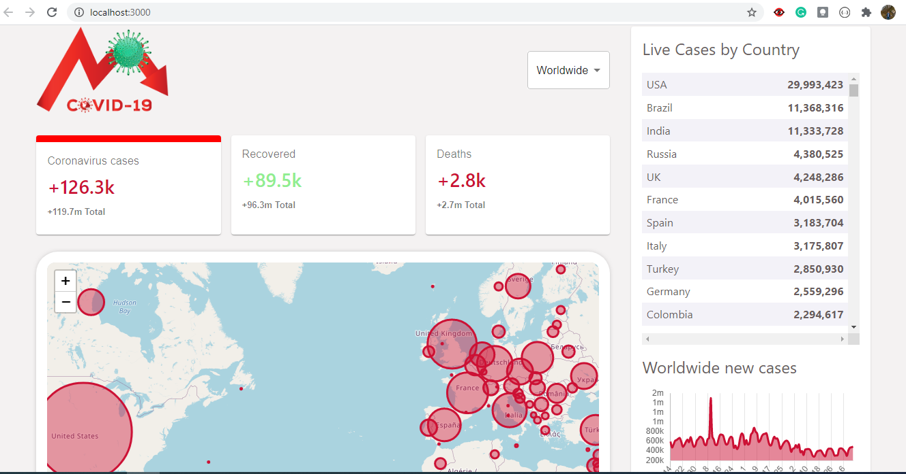

# Covid-19 Tracker App

Covid-19 Tracker is application for tracking number of Covid-19 cases, recoveries and deaths per day
for each country and worldwide. I used disease.sh Docs - An open API for disease-related statistics. 

Covid-19 Tracker App is developed in process of learning ReactJS, Material-UI framework and more.
Deployed live on https://kitic-covid19-tracker.herokuapp.com/ 

